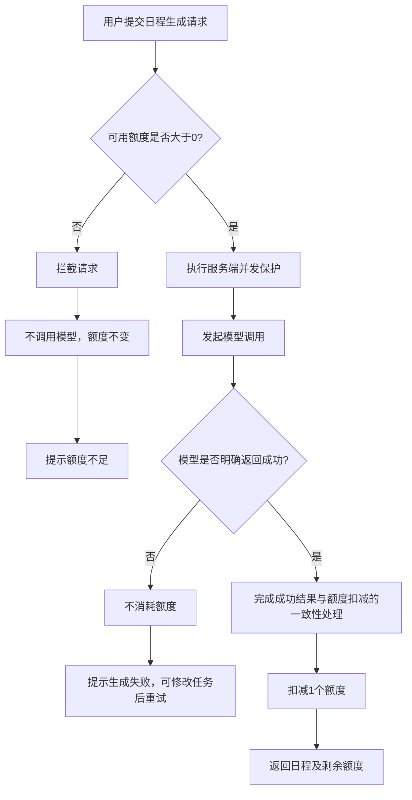

# 日程生成额度处理流程

## 一、流程目标

确保日程生成请求满足额度规则，并在成功、失败及额度不足等情况下提供清晰反馈。

## 二、核心流程

```mermaid
flowchart TD
    A[用户提交日程生成请求] --> B{可用额度是否大于0?}
    B -- 否 --> C[拦截请求]
    C --> D[不调用模型，额度不变]
    D --> E[提示额度不足]

    B -- 是 --> F[执行服务端并发保护]
    F --> G[发起模型调用]
    G --> H{模型是否明确返回成功?}

    H -- 否 --> I[不消耗额度]
    I --> J[提示生成失败，可修改任务后重试]

    H -- 是 --> K[完成成功结果与额度扣减的一致性处理]
    K --> L[扣减1个额度]
    L --> M[返回日程及剩余额度]
```
